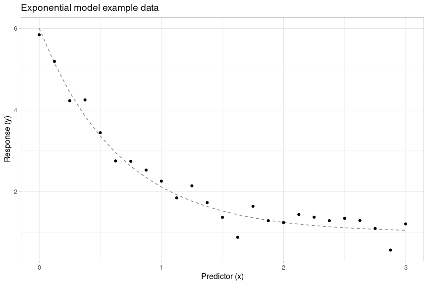
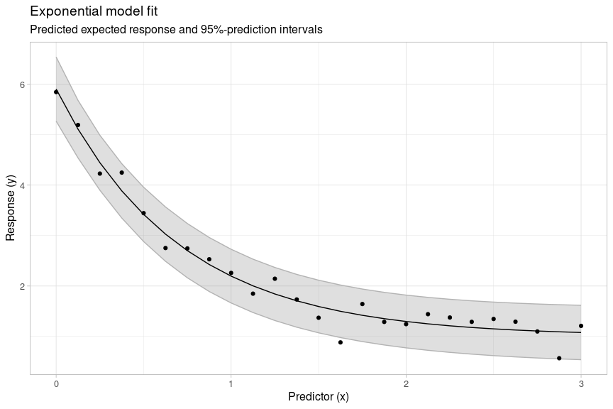
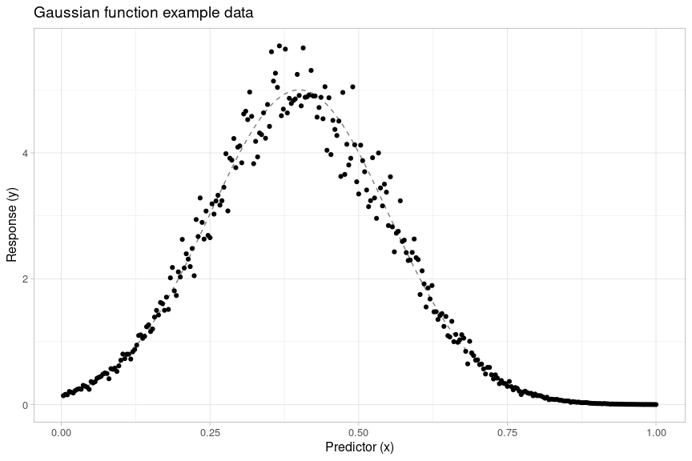
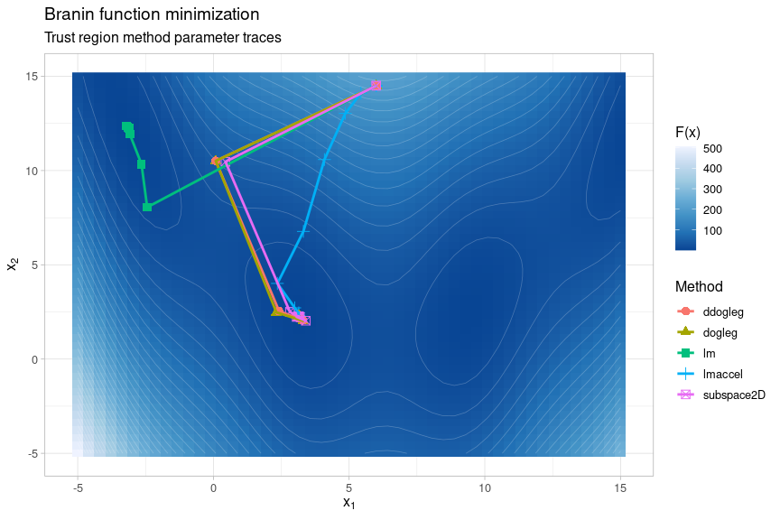

<!-- README.md is generated from README.Rmd. Please edit that file -->

# {gslnls}: GSL nonlinear least-squares fitting in R

<!-- badges: start -->

[](https://github.com/JorisChau/gslnls/actions)
<!-- badges: end -->

The {gslnls}-package provides R bindings to nonlinear least-squares
optimization with the [GNU Scientific Library
(GSL)](https://www.gnu.org/software/gsl/) based on the
`gsl_multifit_nlinear` interface. The following trust region methods to
solve nonlinear least-squares problems are currently made available in
R:

  - [Levenberg-Marquadt](https://www.gnu.org/software/gsl/doc/html/nls.html#levenberg-marquardt)
  - [Levenberg-Marquadt with geodesic
    acceleration](https://www.gnu.org/software/gsl/doc/html/nls.html#levenberg-marquardt-with-geodesic-acceleration)
  - [Dogleg](https://www.gnu.org/software/gsl/doc/html/nls.html#dogleg)
  - [Double
    dogleg](https://www.gnu.org/software/gsl/doc/html/nls.html#double-dogleg)
  - [Two Dimensional
    Subspace](https://www.gnu.org/software/gsl/doc/html/nls.html#two-dimensional-subspace)

The [Tunable
parameters](https://www.gnu.org/software/gsl/doc/html/nls.html#tunable-parameters)
available in the `gsl_multifit_nlinear` interface for the trust method
algorithms can be modified from R in order to help accelerating
convergence for a specific problem at hand.

The GSL Nonlinear Least-Squares Fitting
[webpage](https://www.gnu.org/software/gsl/doc/html/nls.html#nonlinear-least-squares-fitting)
contains a comprehensive overview of the `gsl_multifit_nlinear`
interface and the relevant mathematical background.

## Installation from source

### System requirements

When installing the R-package from source, verify that GSL (\>= 2.2) is
installed on the system, e.g. on Ubuntu/Debian Linux:

    gsl-config --version

If GSL (\>= 2.2) is not available on the system, install GSL from a
pre-compiled binary package (see the examples below) or install GSL from
source by downloading the latest stable release
(<https://www.gnu.org/software/gsl/>) and following the installation
instructions in the included README and INSTALL files.

#### GSL installation examples

##### Ubuntu, Debian

    sudo apt-get install libgsl-dev

##### OSX

    brew install gsl

##### Fedora, RedHat, CentOS

    yum install gsl-devel

##### Windows

On windows, a binary version of GSL (2.7) is automatically downloaded
from <https://github.com/rwinlib/gsl> when installing the R-package, no
additional action is needed.

### R-package installation

With GSL available, install the latest development version of the
R-package from GitHub with:

``` r
devtools::install_github("JorisChau/gslnls")
```

## Example usage

### Example 1: Exponential model

#### Data

The code below simulates  noisy
observations
 from an exponential model with additive (i.i.d.)
Gaussian noise according to:

  
 + b, & i = 1,\\ldots, n \\\\
y_i & = f_i + \\epsilon_i, & \\epsilon_i \\overset{\\text{iid}}{\\sim} N(0,\\sigma^2)
\\end{aligned}
\\right.
")  

The exponential model parameters are set to ,
, , with a
noise standard deviation of .

``` r
set.seed(1)
n <- 50
x <- (seq_len(n) - 1) * 3 / (n - 1)
f <- function(A, lam, b, x) A * exp(-lam * x) + b
y <- f(A = 5, lam = 1.5, b = 1, x) + rnorm(n, sd = 0.25)
```



#### Model fit

The exponential model is fitted to the data using the `gsl_nls()`
function by passing the nonlinear model as a two-sided `formula` and
providing starting parameters for the model parameters  analogous to an `nls()` function call.

``` r
library(gslnls)

ex1_fit <- gsl_nls(
  fn = y ~ A * exp(-lam * x) + b,    ## model formula
  data = data.frame(x = x, y = y),   ## model fit data
  start = c(A = 0, lam = 0, b = 0)   ## starting values
)

ex1_fit
#> Nonlinear regression model
#>   model: y ~ A * exp(-lam * x) + b
#>    data: data.frame(x = x, y = y)
#>      A    lam      b 
#> 4.9905 1.4564 0.9968 
#>  residual sum-of-squares: 2.104
#> 
#> Algorithm: levenberg-marquardt, (scaling: more, solver: qr)
#> 
#> Number of iterations to convergence: 8 
#> Achieved convergence tolerance: 9.503e-11
```

Here, the nonlinear least squares problem has been solved with the
Levenberg-Marquadt algorithm (default) using the following `control`
parameters:

``` r
## default control parameters
gsl_nls_control()
#> $maxiter
#> [1] 50
#> 
#> $scale
#> [1] "more"
#> 
#> $solver
#> [1] "qr"
#> 
#> $fdtype
#> [1] "forward"
#> 
#> $factor_up
#> [1] 3
#> 
#> $factor_down
#> [1] 2
#> 
#> $avmax
#> [1] 0.75
#> 
#> $h_df
#> [1] 1.490116e-08
#> 
#> $h_fvv
#> [1] 0.02
#> 
#> $xtol
#> [1] 1.490116e-08
#> 
#> $ftol
#> [1] 1.490116e-08
#> 
#> $gtol
#> [1] 6.055454e-06
```

Run `?gsl_nls_control` or check the [GSL reference
manual](https://www.gnu.org/software/gsl/doc/html/nls.html#tunable-parameters)
for further details on the available tuning parameters to control the
trust region algorithms.

#### Object methods

The fitted model object returned by `gsl_nls()` is of class `"gsl_nls"`,
which inherits from class `"nls"`. For this reason, generic functions
such as `anova`, `coef`, `confint`, `deviance`, `df.residual`, `fitted`,
`formula`, `logLik`, `predict`, `print` `profile`, `residuals`,
`summary`, `vcov` and `weights` are also applicable for models fitted
with `gsl_nls()`.

``` r
## model summary
summary(ex1_fit)
#> 
#> Formula: y ~ A * exp(-lam * x) + b
#> 
#> Parameters:
#>     Estimate Std. Error t value Pr(>|t|)    
#> A    4.99050    0.11809   42.26   <2e-16 ***
#> lam  1.45641    0.08316   17.51   <2e-16 ***
#> b    0.99677    0.06609   15.08   <2e-16 ***
#> ---
#> Signif. codes:  0 '***' 0.001 '**' 0.01 '*' 0.05 '.' 0.1 ' ' 1
#> 
#> Residual standard error: 0.2116 on 47 degrees of freedom
#> 
#> Number of iterations to convergence: 8 
#> Achieved convergence tolerance: 9.503e-11

## profile confidence intervals
confint(ex1_fit)
#>          2.5%    97.5%
#> A   4.7542105 5.228848
#> lam 1.2974126 1.625666
#> b   0.8583933 1.122182
```

The `predict` method extends the existing `predict.nls` method by
allowing for calculation of asymptotic confidence and prediction
(tolerance) intervals in addition to prediction of the expected
response:

``` r
## asymptotic prediction intervals
predict(ex1_fit, interval = "prediction", level = 0.95)
#>            fit       lwr      upr
#>  [1,] 5.987268 5.4935305 6.481006
#>  [2,] 5.561539 5.0897270 6.033351
#>  [3,] 5.172128 4.7147493 5.629507
#>  [4,] 4.815937 4.3675472 5.264327
#>  [5,] 4.490132 4.0469689 4.933295
....
```



#### Jacobian calculation

If the `jac` argument in `gsl_nls()` is undefined, the Jacobian matrix
used to solve the [trust region
subproblem](https://www.gnu.org/software/gsl/doc/html/nls.html#solving-the-trust-region-subproblem-trs)
is approximated by forward (or centered) finite differences. Instead, an
analytic Jacobian can be passed to `jac` by defining a function that
returns the ")-dimensional Jacobian matrix of the nonlinear model
`fn`, where the first argument must be the vector of parameters of
length .

In the exponential model example, the Jacobian matrix is a ")-dimensional matrix
![\[\\boldsymbol{J}\_{ij}\]\_{ij}](https://latex.codecogs.com/png.latex?%5B%5Cboldsymbol%7BJ%7D_%7Bij%7D%5D_%7Bij%7D
"[\\boldsymbol{J}_{ij}]_{ij}") with rows:

  
![&#10;\\boldsymbol{J}\_i \\ = \\ \\left\[ \\frac{\\partial
f\_i}{\\partial A}, \\frac{\\partial f\_i}{\\partial \\lambda},
\\frac{\\partial f\_i}{\\partial b} \\right\] \\ = \\ \\left\[
\\exp(-\\lambda \\cdot x\_i), -A \\cdot \\exp(-\\lambda \\cdot x\_i)
\\cdot x\_i, 1
\\right\]&#10;](https://latex.codecogs.com/png.latex?%0A%5Cboldsymbol%7BJ%7D_i%20%5C%20%3D%20%5C%20%5Cleft%5B%20%5Cfrac%7B%5Cpartial%20f_i%7D%7B%5Cpartial%20A%7D%2C%20%5Cfrac%7B%5Cpartial%20f_i%7D%7B%5Cpartial%20%5Clambda%7D%2C%20%5Cfrac%7B%5Cpartial%20f_i%7D%7B%5Cpartial%20b%7D%20%5Cright%5D%20%5C%20%3D%20%5C%20%5Cleft%5B%20%5Cexp%28-%5Clambda%20%5Ccdot%20x_i%29%2C%20-A%20%5Ccdot%20%5Cexp%28-%5Clambda%20%5Ccdot%20x_i%29%20%5Ccdot%20x_i%2C%201%20%5Cright%5D%0A
"
\\boldsymbol{J}_i \\ = \\ \\left[ \\frac{\\partial f_i}{\\partial A}, \\frac{\\partial f_i}{\\partial \\lambda}, \\frac{\\partial f_i}{\\partial b} \\right] \\ = \\ \\left[ \\exp(-\\lambda \\cdot x_i), -A \\cdot \\exp(-\\lambda \\cdot x_i) \\cdot x_i, 1 \\right]
")  

which is encoded in the following call to `gsl_nls()`:

``` r
## analytic Jacobian
gsl_nls(
  fn = y ~ A * exp(-lam * x) + b,    ## model formula
  data = data.frame(x = x, y = y),   ## model fit data
  start = c(A = 0, lam = 0, b = 0),  ## starting values
  jac = function(par) with(as.list(par), cbind(A = exp(-lam * x), lam = -A * x * exp(-lam * x), b = 1))
)
#> Nonlinear regression model
#>   model: y ~ A * exp(-lam * x) + b
#>    data: data.frame(x = x, y = y)
#>      A    lam      b 
#> 4.9905 1.4564 0.9968 
#>  residual sum-of-squares: 2.104
#> 
#> Algorithm: levenberg-marquardt, (scaling: more, solver: qr)
#> 
#> Number of iterations to convergence: 8 
#> Achieved convergence tolerance: 9.496e-11
```

Alternatively, a self-starting nonlinear model (see `?selfStart`) can be
passed to `gsl_nls()`, in which case the Jacobian matrix is evaluated
from the `"gradient"` attribute of the self-starting model object:

``` r
## self-starting model
gsl_nls(
  fn =  y ~ SSasymp(x, Asym, R0, lrc),    ## model formula
  data = data.frame(x = x, y = y)         ## model fit data
)
#> Nonlinear regression model
#>   model: y ~ SSasymp(x, Asym, R0, lrc)
#>    data: data.frame(x = x, y = y)
#>   Asym     R0    lrc 
#> 0.9968 5.9873 0.3760 
#>  residual sum-of-squares: 2.104
#> 
#> Algorithm: levenberg-marquardt, (scaling: more, solver: qr)
#> 
#> Number of iterations to convergence: 1 
#> Achieved convergence tolerance: 1.762e-12
```

**Remark**: the self-starting model `SSasymp()` uses a slightly
different model parameterization (`A = R0 - Asym`, `lam = exp(lrc)`, `b
= Asym`), but the fitted models are equivalent. Also, when using a
*self-starting* model, no starting values need to be provided.

### Example 2: Gaussian function

#### Data

The following code generates 
noisy observations
 from a Gaussian function with multiplicative
independent Gaussian noise according to the model:

  
^2}{2c^2}\\right), & i = 1,\\ldots, n \\\\
y_i & = f_i \\cdot \\epsilon_i, & \\epsilon_i \\overset{\\text{iid}}{\\sim} N(1,\\sigma^2)
\\end{aligned}
\\right.
")  

The parameters of the Gaussian model function are set to , ,
, with noise standard deviation  (see also
<https://www.gnu.org/software/gsl/doc/html/nls.html#geodesic-acceleration-example-2>).

``` r
set.seed(1)
n <- 300
x <- seq_len(n) / n
f <- function(a, b, c, x) a * exp(-(x - b)^2 / (2 * c^2))
y <- f(a = 5, b = 0.4, c = 0.15, x) * rnorm(n, mean = 1, sd = 0.1)
```



#### Model fit

Using the default
[Levenberg-Marquadt](https://www.gnu.org/software/gsl/doc/html/nls.html#levenberg-marquardt)
algorithm (without geodesic acceleration), the nonlinear Gaussian model
can be fitted with a call to `gsl_nls()` analogous to the previous
example. Here, the `trace` argument is activated in order to print
additional convergence information at each solver iteration; `ssr` is
the current sum of squared residuals, `cond(J)` is the condition number
of the Jacobian matrix, and `|a|/|v|` is the ratio of the acceleration
term to the velocity term when using geodesic acceleration.

``` r
## Levenberg-Marquadt (default)
ex2a_fit <- gsl_nls(
  fn = y ~ a * exp(-(x - b)^2 / (2 * c^2)), ## model formula
  data = data.frame(x = x, y = y),          ## model fit data
  start = c(a = 1, b = 0, c = 1),           ## starting values
  trace = TRUE                              ## verbose output
)
#> iter 0: ssr = 1192.49, cond(J) = -nan, |a|/|v| = 0
#> iter 1: ssr = 997.455, cond(J) = 29.1802, |a|/|v| = 0
#> iter 2: ssr = 969.039, cond(J) = 1223.57, |a|/|v| = 0
#> iter 3: ssr = 954.562, cond(J) = 2518.24, |a|/|v| = 0
#> iter 4: ssr = 948.377, cond(J) = 2916.14, |a|/|v| = 0
#> iter 5: ssr = 944.512, cond(J) = 3760.78, |a|/|v| = 0
#> iter 6: ssr = 938.632, cond(J) = 3446.52, |a|/|v| = 0
#> iter 7: ssr = 929.886, cond(J) = 4875.9, |a|/|v| = 0
#> iter 8: ssr = 920.215, cond(J) = 3420.25, |a|/|v| = 0
#> iter 9: ssr = 913.041, cond(J) = 2169.93, |a|/|v| = 0
#> iter 10: ssr = 903.168, cond(J) = 1627.72, |a|/|v| = 0
#> iter 11: ssr = 887.731, cond(J) = 973.208, |a|/|v| = 0
#> iter 12: ssr = 870.975, cond(J) = 617.136, |a|/|v| = 0
#> iter 13: ssr = 857.044, cond(J) = 537.894, |a|/|v| = 0
#> iter 14: ssr = 840.912, cond(J) = 484.813, |a|/|v| = 0
#> iter 15: ssr = 819, cond(J) = 321.328, |a|/|v| = 0
#> iter 16: ssr = 697.556, cond(J) = 95.6252, |a|/|v| = 0
#> iter 17: ssr = 662.441, cond(J) = 4.75319, |a|/|v| = 0
#> iter 18: ssr = 544.736, cond(J) = 5.45748, |a|/|v| = 0
#> iter 19: ssr = 320.202, cond(J) = 8.27146, |a|/|v| = 0
#> iter 20: ssr = 102.897, cond(J) = 14.4964, |a|/|v| = 0
#> iter 21: ssr = 23.9684, cond(J) = 23.7227, |a|/|v| = 0
#> iter 22: ssr = 16.4604, cond(J) = 31.8506, |a|/|v| = 0
#> iter 23: ssr = 16.347, cond(J) = 34.8131, |a|/|v| = 0
#> iter 24: ssr = 16.3468, cond(J) = 35.2818, |a|/|v| = 0
#> iter 25: ssr = 16.3468, cond(J) = 35.3034, |a|/|v| = 0
#> iter 26: ssr = 16.3468, cond(J) = 35.3038, |a|/|v| = 0
#> *******************
#> summary from method 'trust-region/levenberg-marquardt'
#> number of iterations: 26
#> reason for stopping: output range error
#> initial ssr = 1192.49
#> final ssr = 16.3468
#> ssr/dof = 0.0550398
#> ssr achieved tolerance = 7.68807e-12
#> function evaluations: 126
#> Jacobian evaluations: 0
#> fvv evaluations: 0
#> status = success
#> *******************

ex2a_fit
#> Nonlinear regression model
#>   model: y ~ a * exp(-(x - b)^2/(2 * c^2))
#>    data: data.frame(x = x, y = y)
#>       a       b       c 
#>  4.9565  0.3982 -0.1515 
#>  residual sum-of-squares: 16.35
#> 
#> Algorithm: levenberg-marquardt, (scaling: more, solver: qr)
#> 
#> Number of iterations to convergence: 26 
#> Achieved convergence tolerance: 7.688e-12
```

#### Geodesic acceleration

The nonlinear model can also be fitted using the Levenberg-Marquadt
algorithm with [geodesic
acceleration](https://www.gnu.org/software/gsl/doc/html/nls.html#levenberg-marquardt-with-geodesic-acceleration)
by changing the default `algorithm = "lm"` to `algorithm = "lmaccel"`.
In the console output, larger values of `|a|/|v|` indicate that the
geodesic acceleration correction term is contributing (substantial)
information to the solver relative to the standard Levenberg-Marquadt
velocity step.

``` r
## Levenberg-Marquadt w/ geodesic acceleration
ex2b_fit <- gsl_nls(
  fn = y ~ a * exp(-(x - b)^2 / (2 * c^2)), ## model formula
  data = data.frame(x = x, y = y),          ## model fit data
  start = c(a = 1, b = 0, c = 1),           ## starting values
  algorithm = "lmaccel",                    ## algorithm
  trace = TRUE                              ## verbose output
)
#> iter 0: ssr = 1192.49, cond(J) = -nan, |a|/|v| = 0
#> iter 1: ssr = 902.787, cond(J) = 29.1802, |a|/|v| = 0.288
#> iter 2: ssr = 726.988, cond(J) = 3.53773, |a|/|v| = 0.233334
#> iter 3: ssr = 444.339, cond(J) = 5.56604, |a|/|v| = 0.304665
#> iter 4: ssr = 151.97, cond(J) = 9.70655, |a|/|v| = 0.260019
#> iter 5: ssr = 30.071, cond(J) = 17.8093, |a|/|v| = 0.184693
#> iter 6: ssr = 16.5987, cond(J) = 28.9632, |a|/|v| = 0.0638111
#> iter 7: ssr = 16.3475, cond(J) = 34.4312, |a|/|v| = 0.00682439
#> iter 8: ssr = 16.3468, cond(J) = 35.2603, |a|/|v| = 0.000346826
#> iter 9: ssr = 16.3468, cond(J) = 35.3031, |a|/|v| = 1.29364e-05
#> iter 10: ssr = 16.3468, cond(J) = 35.3038, |a|/|v| = 1.79918e-06
#> *******************
#> summary from method 'trust-region/levenberg-marquardt+accel'
#> number of iterations: 10
#> reason for stopping: output range error
#> initial ssr = 1192.49
#> final ssr = 16.3468
#> ssr/dof = 0.0550398
#> ssr achieved tolerance = 4.29345e-11
#> function evaluations: 66
#> Jacobian evaluations: 0
#> fvv evaluations: 0
#> status = success
#> *******************

ex2b_fit
#> Nonlinear regression model
#>   model: y ~ a * exp(-(x - b)^2/(2 * c^2))
#>    data: data.frame(x = x, y = y)
#>      a      b      c 
#> 4.9565 0.3982 0.1515 
#>  residual sum-of-squares: 16.35
#> 
#> Algorithm: levenberg-marquardt+accel, (scaling: more, solver: qr)
#> 
#> Number of iterations to convergence: 10 
#> Achieved convergence tolerance: 4.293e-11
```

With geodesic acceleration enabled the method converges after 10
iterations, whereas the method without geodesic acceleration required 26
iterations. This indicates that the nonlinear least-squares solver
benefits (substantially) from the geodesic acceleration correction.

##### Second directional derivative

By default, if the `fvv` argument is undefined, the second directional
derivative  used to calculate the geodesic acceleration correction is
approximated by forward (or centered) finite differences. To use an
analytic expression for , a
function returning the -dimensional vector of second directional derivatives of the
nonlinear model can be passed to `fvv`. The first argument of the
function must be the vector of parameters of length
 and the second argument
must be the velocity vector, also of length
.

For the Gaussian model function, the matrix of second partial
derivatives, i.e. the Hessian, is given by
(cf. <https://www.gnu.org/software/gsl/doc/html/nls.html#geodesic-acceleration-example-2>):

  
![&#10;\\boldsymbol{H}\_{f\_i} \\ = \\ &#10;\\left\[\\begin{matrix}
&#10;\\frac{\\partial^2 f\_i}{\\partial a^2} & \\frac{\\partial^2
f\_i}{\\partial a \\partial b} & \\frac{\\partial^2 f\_i}{\\partial a
\\partial c} \\\\&#10;& \\frac{\\partial^2 f\_i}{\\partial b^2} &
\\frac{\\partial^2 f\_i}{\\partial b \\partial c} \\\\&#10;& &
\\frac{\\partial^2 f\_i}{\\partial c^2}&#10;\\end{matrix}\\right\] \\ =
\\ &#10;\\left\[\\begin{matrix}&#10;0 & -\\frac{z\_i}{c} e\_i &
-\\frac{z\_i^2}{c} e\_i \\\\&#10;& \\frac{a}{c^2} (1 - z\_i^2) e\_i &
\\frac{a}{c^2} z\_i (2 - z\_i^2) e\_i \\\\&#10;& & \\frac{a}{c^2} z\_i^2
(3 - z\_i^2) e\_i
&#10;\\end{matrix}\\right\]&#10;](https://latex.codecogs.com/png.latex?%0A%5Cboldsymbol%7BH%7D_%7Bf_i%7D%20%5C%20%3D%20%5C%20%0A%5Cleft%5B%5Cbegin%7Bmatrix%7D%20%0A%5Cfrac%7B%5Cpartial%5E2%20f_i%7D%7B%5Cpartial%20a%5E2%7D%20%26%20%5Cfrac%7B%5Cpartial%5E2%20f_i%7D%7B%5Cpartial%20a%20%5Cpartial%20b%7D%20%26%20%5Cfrac%7B%5Cpartial%5E2%20f_i%7D%7B%5Cpartial%20a%20%5Cpartial%20c%7D%20%5C%5C%0A%26%20%5Cfrac%7B%5Cpartial%5E2%20f_i%7D%7B%5Cpartial%20b%5E2%7D%20%26%20%5Cfrac%7B%5Cpartial%5E2%20f_i%7D%7B%5Cpartial%20b%20%5Cpartial%20c%7D%20%5C%5C%0A%26%20%26%20%5Cfrac%7B%5Cpartial%5E2%20f_i%7D%7B%5Cpartial%20c%5E2%7D%0A%5Cend%7Bmatrix%7D%5Cright%5D%20%5C%20%3D%20%5C%20%0A%5Cleft%5B%5Cbegin%7Bmatrix%7D%0A0%20%26%20-%5Cfrac%7Bz_i%7D%7Bc%7D%20e_i%20%26%20-%5Cfrac%7Bz_i%5E2%7D%7Bc%7D%20e_i%20%5C%5C%0A%26%20%5Cfrac%7Ba%7D%7Bc%5E2%7D%20%281%20-%20z_i%5E2%29%20e_i%20%26%20%5Cfrac%7Ba%7D%7Bc%5E2%7D%20z_i%20%282%20-%20z_i%5E2%29%20e_i%20%5C%5C%0A%26%20%26%20%5Cfrac%7Ba%7D%7Bc%5E2%7D%20z_i%5E2%20%283%20-%20z_i%5E2%29%20e_i%20%0A%5Cend%7Bmatrix%7D%5Cright%5D%0A
"
\\boldsymbol{H}_{f_i} \\ = \\ 
\\left[\\begin{matrix} 
\\frac{\\partial^2 f_i}{\\partial a^2} & \\frac{\\partial^2 f_i}{\\partial a \\partial b} & \\frac{\\partial^2 f_i}{\\partial a \\partial c} \\\\
& \\frac{\\partial^2 f_i}{\\partial b^2} & \\frac{\\partial^2 f_i}{\\partial b \\partial c} \\\\
& & \\frac{\\partial^2 f_i}{\\partial c^2}
\\end{matrix}\\right] \\ = \\ 
\\left[\\begin{matrix}
0 & -\\frac{z_i}{c} e_i & -\\frac{z_i^2}{c} e_i \\\\
& \\frac{a}{c^2} (1 - z_i^2) e_i & \\frac{a}{c^2} z_i (2 - z_i^2) e_i \\\\
& & \\frac{a}{c^2} z_i^2 (3 - z_i^2) e_i 
\\end{matrix}\\right]
")  
where the lower half of the Hessian matrix is omitted since it is
symmetric and where we use the notation,

  

\\end{aligned}
")  

Based on the Hessian matrix, the second directional derivative of
, with , becomes:

  
![&#10;\\begin{aligned}&#10;D\_v^2 f\_i & \\ = \\ \\sum\_{j,k}
v\_{\\theta\_j}v\_{\\theta\_k} \\frac{\\partial^2 f\_i}{\\partial
\\theta\_j \\partial \\theta\_k} \\\\&#10;& \\ = \\ v\_a^2
\\frac{\\partial^2 f\_i}{\\partial a^2} + 2 v\_av\_b\\frac{\\partial^2
f\_i}{\\partial a \\partial b} + 2v\_av\_c\\frac{\\partial^2
f\_i}{\\partial a \\partial c} + v\_b^2\\frac{\\partial^2
f\_i}{\\partial b^2} + 2v\_bv\_c\\frac{\\partial^2 f\_i}{\\partial b
\\partial c} + v\_c^2\\frac{\\partial^2 f\_i}{\\partial c^2} \\\\&#10;&
\\ = \\ -2v\_a v\_b\\frac{z\_i}{c} e\_i - 2v\_av\_c \\frac{z\_i^2}{c}
e\_i + v\_b^2\\frac{a}{c^2} (1 - z\_i^2) e\_i + 2v\_bv\_c \\frac{a}{c^2}
z\_i (2 - z\_i^2) e\_i + v\_c^2\\frac{a}{c^2} z\_i^2 (3 - z\_i^2)
e\_i&#10;\\end{aligned}&#10;](https://latex.codecogs.com/png.latex?%0A%5Cbegin%7Baligned%7D%0AD_v%5E2%20f_i%20%26%20%5C%20%3D%20%5C%20%5Csum_%7Bj%2Ck%7D%20v_%7B%5Ctheta_j%7Dv_%7B%5Ctheta_k%7D%20%5Cfrac%7B%5Cpartial%5E2%20f_i%7D%7B%5Cpartial%20%5Ctheta_j%20%5Cpartial%20%5Ctheta_k%7D%20%5C%5C%0A%26%20%5C%20%3D%20%5C%20v_a%5E2%20%5Cfrac%7B%5Cpartial%5E2%20f_i%7D%7B%5Cpartial%20a%5E2%7D%20%2B%202%20v_av_b%5Cfrac%7B%5Cpartial%5E2%20f_i%7D%7B%5Cpartial%20a%20%5Cpartial%20b%7D%20%2B%202v_av_c%5Cfrac%7B%5Cpartial%5E2%20f_i%7D%7B%5Cpartial%20a%20%5Cpartial%20c%7D%20%2B%20v_b%5E2%5Cfrac%7B%5Cpartial%5E2%20f_i%7D%7B%5Cpartial%20b%5E2%7D%20%2B%202v_bv_c%5Cfrac%7B%5Cpartial%5E2%20f_i%7D%7B%5Cpartial%20b%20%5Cpartial%20c%7D%20%2B%20v_c%5E2%5Cfrac%7B%5Cpartial%5E2%20f_i%7D%7B%5Cpartial%20c%5E2%7D%20%5C%5C%0A%26%20%5C%20%3D%20%5C%20-2v_a%20v_b%5Cfrac%7Bz_i%7D%7Bc%7D%20e_i%20-%202v_av_c%20%5Cfrac%7Bz_i%5E2%7D%7Bc%7D%20e_i%20%2B%20v_b%5E2%5Cfrac%7Ba%7D%7Bc%5E2%7D%20%281%20-%20z_i%5E2%29%20e_i%20%2B%202v_bv_c%20%5Cfrac%7Ba%7D%7Bc%5E2%7D%20z_i%20%282%20-%20z_i%5E2%29%20e_i%20%2B%20v_c%5E2%5Cfrac%7Ba%7D%7Bc%5E2%7D%20z_i%5E2%20%283%20-%20z_i%5E2%29%20e_i%0A%5Cend%7Baligned%7D%0A
"
\\begin{aligned}
D_v^2 f_i & \\ = \\ \\sum_{j,k} v_{\\theta_j}v_{\\theta_k} \\frac{\\partial^2 f_i}{\\partial \\theta_j \\partial \\theta_k} \\\\
& \\ = \\ v_a^2 \\frac{\\partial^2 f_i}{\\partial a^2} + 2 v_av_b\\frac{\\partial^2 f_i}{\\partial a \\partial b} + 2v_av_c\\frac{\\partial^2 f_i}{\\partial a \\partial c} + v_b^2\\frac{\\partial^2 f_i}{\\partial b^2} + 2v_bv_c\\frac{\\partial^2 f_i}{\\partial b \\partial c} + v_c^2\\frac{\\partial^2 f_i}{\\partial c^2} \\\\
& \\ = \\ -2v_a v_b\\frac{z_i}{c} e_i - 2v_av_c \\frac{z_i^2}{c} e_i + v_b^2\\frac{a}{c^2} (1 - z_i^2) e_i + 2v_bv_c \\frac{a}{c^2} z_i (2 - z_i^2) e_i + v_c^2\\frac{a}{c^2} z_i^2 (3 - z_i^2) e_i
\\end{aligned}
")  

which can be encoded using `gsl_nls()` as follows:

``` r
## second directional derivative
fvv <- function(par, v, xi) {
  with(as.list(par), {
    zi <- (xi - b) / c
    ei <- exp(-zi^2 / 2)
    -2 * v[["a"]] * v[["b"]] * zi / c * ei - 2 * v[["a"]] * v[["c"]] * zi^2 / c * ei + 
      v[["b"]]^2 * a / c^2 * (1 - zi^2) * ei + 2 * v[["b"]] * v[["c"]] * a / c^2 * zi * (2 - zi^2) * ei + 
      v[["c"]]^2 * a / c^2 * zi^2 * (3 - zi^2) * ei
  })
}

ex2c_fit <- gsl_nls(
  fn = y ~ a * exp(-(x - b)^2 / (2 * c^2)), ## model formula
  data = data.frame(x = x, y = y),          ## model fit data
  start = c(a = 1, b = 0, c = 1),           ## starting values
  algorithm = "lmaccel",                    ## algorithm
  trace = TRUE,                             ## verbose output
  fvv = fvv,                                ## analytic fvv 
  xi = x                                    ## fvv function argument 
)
#> iter 0: ssr = 1192.49, cond(J) = inf, |a|/|v| = 0
#> iter 1: ssr = 985.222, cond(J) = 29.1802, |a|/|v| = 0.285933
#> iter 2: ssr = 871.164, cond(J) = 6.33554, |a|/|v| = 0.331994
#> iter 3: ssr = 749.318, cond(J) = 6.52269, |a|/|v| = 0.0313447
#> iter 4: ssr = 542.661, cond(J) = 4.51806, |a|/|v| = 0.223825
#> iter 5: ssr = 477.623, cond(J) = 9.1331, |a|/|v| = 0.22102
#> iter 6: ssr = 162.906, cond(J) = 22.9306, |a|/|v| = 0.378617
#> iter 7: ssr = 74.5766, cond(J) = 18.6389, |a|/|v| = 0.038455
#> iter 8: ssr = 25.4786, cond(J) = 24.6805, |a|/|v| = 0.0314638
#> iter 9: ssr = 16.5859, cond(J) = 31.6505, |a|/|v| = 0.00499098
#> iter 10: ssr = 16.3478, cond(J) = 34.628, |a|/|v| = 0.00192749
#> iter 11: ssr = 16.3468, cond(J) = 35.2583, |a|/|v| = 0.000180849
#> iter 12: ssr = 16.3468, cond(J) = 35.3027, |a|/|v| = 8.40295e-06
#> iter 13: ssr = 16.3468, cond(J) = 35.3038, |a|/|v| = 3.23773e-07
#> *******************
#> summary from method 'trust-region/levenberg-marquardt+accel'
#> number of iterations: 13
#> reason for stopping: output range error
#> initial ssr = 1192.49
#> final ssr = 16.3468
#> ssr/dof = 0.0550398
#> ssr achieved tolerance = 6.77183e-11
#> function evaluations: 62
#> Jacobian evaluations: 0
#> fvv evaluations: 19
#> status = success
#> *******************

ex2c_fit
#> Nonlinear regression model
#>   model: y ~ a * exp(-(x - b)^2/(2 * c^2))
#>    data: data.frame(x = x, y = y)
#>      a      b      c 
#> 4.9565 0.3982 0.1515 
#>  residual sum-of-squares: 16.35
#> 
#> Algorithm: levenberg-marquardt+accel, (scaling: more, solver: qr)
#> 
#> Number of iterations to convergence: 13 
#> Achieved convergence tolerance: 6.772e-11
```

### Example 3: Branin function

As a third example, we compare the available trust region methods by
minimizing the Branin test function, a common optimization test problem.
For the Branin test function, the following bivariate expression is
used:

  
 & \\ = \\ f_1(x_1, x_2)^2 + f_2(x_1, x_2)^2 \\\\
f_1(x_1, x_2) & \\ = \\ x_2 + a_1 x_1^2 + a_2 x_1 + a_3 \\\\
f_2(x_1, x_2) & \\ = \\ \\sqrt{a_4 \\cdot (1 + (1 - a_5) \\cos(x_1))}
\\end{aligned}
\\right.
")  

with known constants "), , ,
, ")
(cf. <https://www.gnu.org/software/gsl/doc/html/nls.html#comparing-trs-methods-example>),
such that ") has three local minima in the range ![(x\_1, x\_2) \\in
\[-5, 15\] \\times
\[-5, 15\]](https://latex.codecogs.com/png.latex?%28x_1%2C%20x_2%29%20%5Cin%20%5B-5%2C%2015%5D%20%5Ctimes%20%5B-5%2C%2015%5D
"(x_1, x_2) \\in [-5, 15] \\times [-5, 15]").

The minimization problem can be solved with `gsl_nls()` by considering
the cost function ") as a sum of squared residuals in which ") and ") are two residuals relative to two zero responses. Here,
instead of passing a `formula` to `gsl_nls()`, the nonlinear model is
passed directly as a `function`. The first parameter of the function is
the vector of parameters, i.e. "), and the function returns the vector of model evaluations,
i.e. , f_2(x_1, x_2))"). When passing a `function` instead of
`formula` to `gsl_nls()`, the vector of observed responses should be
included in the `y` argument. In this example, `y` is set to a vector of
zeros. As starting values, we use  and
 equivalent to the example in the GSL reference manual.

``` r
## Branin model function
branin <- function(x) {
  a <- c(-5.1 / (4 * pi^2), 5 / pi, -6, 10, 1 / (8 * pi))
  f1 <- x[2] + a[1] * x[1]^2 + a[2] * x[1] + a[3] 
  f2 <- sqrt(a[4] * (1 + (1 - a[5]) * cos(x[1])))
  c(f1, f2)
}

## Levenberg-Marquadt minimization
ex3_fit <- gsl_nls(
  fn = branin,                   ## model function      
  y = c(0, 0),                   ## response vector 
  start = c(x1 = 6, x2 = 14.5),  ## starting values
  algorithm = "lm"               ## algorithm
)

ex3_fit
#> Nonlinear regression model
#>   model: y ~ fn(x)
#>     x1     x2 
#> -3.142 12.275 
#>  residual sum-of-squares: 0.3979
#> 
#> Algorithm: levenberg-marquardt, (scaling: more, solver: qr)
#> 
#> Number of iterations to convergence: 17 
#> Achieved convergence tolerance: 1.989e-12
```

**Note**: When using the `function` method of `gsl_nls()`, the returned
object no longer has class `"nls"`,

``` r
class(ex3_fit)
#> [1] "gsl_nls"
```

However, all generics `anova`, `coef`, `confint`, `deviance`,
`df.residual`, `fitted`, `formula`, `logLik`, `predict`, `print`,
`residuals`, `summary`, `vcov` and `weights` remain applicable to
objects (only) of class `"gls_nls"`.

#### Method comparisons

Solving the same minimization problem with all available trust region
methods, i.e. `algorithm` set to `"lm"`, `"lmaccel"`, `"dogleg"`,
`"ddogleg"` and `"subspace2D"` respectively, and tracing the parameter
values at each iteration, we can visualize the minimization paths
followed by each method.



Analogous to the
[example](https://www.gnu.org/software/gsl/doc/html/nls.html#comparing-trs-methods-example)
in the GSL reference manual, the standard Levenberg-Marquadt method
without geodesic acceleration converges to the minimum at
"), all other methods converge to the minimum at
").

# References

<div id="refs" class="references">

<div id="ref-gsl_manual">

Galassi, M., J. Davies, J. Theiler, B. Gough, G. Jungman, M. Booth, and
F. Rossi. 2009. *GNU Scientific Library Reference Manual (3rd Ed.), ISBN
0954612078*.

</div>

</div>
