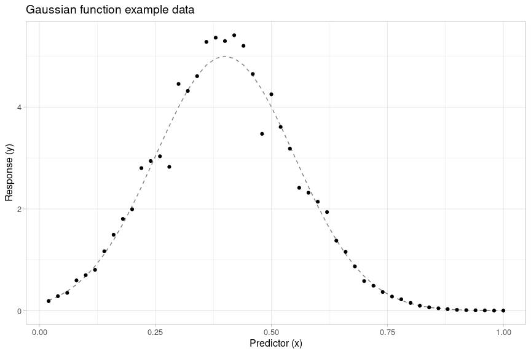

<!-- README.md is generated from README.Rmd. Please edit that file -->

# {gslnls}: GSL nonlinear least-squares fitting in R

<!-- badges: start -->

[](https://cran.r-project.org/package=gslnls)
[](https://github.com/JorisChau/gslnls/actions)
[](https://CRAN.R-project.org/package=gslnls)
[](https://cran.r-project.org/package=gslnls)
<!-- badges: end -->

The {gslnls}-package provides R bindings to nonlinear least-squares
optimization with the [GNU Scientific Library
(GSL)](https://www.gnu.org/software/gsl/) based on the
`gsl_multifit_nlinear` interface. The following trust region methods to
solve nonlinear least-squares problems are currently made available in
R:

-   [Levenberg-Marquadt](https://www.gnu.org/software/gsl/doc/html/nls.html#levenberg-marquardt)
-   [Levenberg-Marquadt with geodesic
    acceleration](https://www.gnu.org/software/gsl/doc/html/nls.html#levenberg-marquardt-with-geodesic-acceleration)
-   [Dogleg](https://www.gnu.org/software/gsl/doc/html/nls.html#dogleg)
-   [Double
    dogleg](https://www.gnu.org/software/gsl/doc/html/nls.html#double-dogleg)
-   [Two Dimensional
    Subspace](https://www.gnu.org/software/gsl/doc/html/nls.html#two-dimensional-subspace)

The [Tunable
parameters](https://www.gnu.org/software/gsl/doc/html/nls.html#tunable-parameters)
available in the `gsl_multifit_nlinear` interface for the trust method
algorithms can be modified from R in order to help accelerating
convergence for a specific problem at hand.

The GSL Nonlinear Least-Squares Fitting
[webpage](https://www.gnu.org/software/gsl/doc/html/nls.html#nonlinear-least-squares-fitting)
contains a comprehensive overview of the `gsl_multifit_nlinear`
interface and the relevant mathematical background.

## Installation from source

### System requirements

When installing the R-package from source, verify that GSL (>= 2.2) is
installed on the system, e.g. on Ubuntu/Debian Linux:

    gsl-config --version

If GSL (>= 2.2) is not available on the system, install GSL from a
pre-compiled binary package (see the examples below) or install GSL from
source by downloading the latest stable release
(<https://www.gnu.org/software/gsl/>) and following the installation
instructions in the included README and INSTALL files.

#### GSL installation examples

##### Ubuntu, Debian

    sudo apt-get install libgsl-dev

##### macOS

    brew install gsl

##### Fedora, RedHat, CentOS

    yum install gsl-devel

##### Windows

On windows, a binary version of GSL (2.7) is automatically downloaded
from <https://github.com/rwinlib/gsl> when installing the R-package, no
additional action is needed.

### R-package installation

With GSL available, install the R-package from source with:

``` r
## Install latest CRAN release:
install.packages("gslnls", type = "source")
```

or install the latest development version from GitHub with:

``` r
## Install latest GitHub development version:
# install.packages("devtools")
devtools::install_github("JorisChau/gslnls")
```

## Installation from binary

On windows and some macOS builds, the R-package can be installed from
CRAN as a binary package. In this case, GSL does not need to be
available on the system.

``` r
## Install latest CRAN release:
install.packages("gslnls")
```

## Example usage

### Example 1: Exponential model

#### Data

The code below simulates

noisy observations

from an exponential model with additive (i.i.d.) Gaussian noise
according to:

 + b, & i = 1,\ldots, n \\
y_i & = f_i + \epsilon_i, & \epsilon_i \overset{\text{iid}}{\sim} N(0,\sigma^2)
\end{aligned}
\right.
")

The exponential model parameters are set to
,
,
, with
a noise standard deviation of
.

``` r
set.seed(1)
n <- 50
x <- (seq_len(n) - 1) * 3 / (n - 1)
f <- function(A, lam, b, x) A * exp(-lam * x) + b
y <- f(A = 5, lam = 1.5, b = 1, x) + rnorm(n, sd = 0.25)
```


#### Model fit

The exponential model is fitted to the data using the `gsl_nls()`
function by passing the nonlinear model as a two-sided `formula` and
providing starting parameters for the model parameters

analogous to an `nls()` function call.

``` r
library(gslnls)

ex1_fit <- gsl_nls(
  fn = y ~ A * exp(-lam * x) + b,    ## model formula
  data = data.frame(x = x, y = y),   ## model fit data
  start = c(A = 0, lam = 0, b = 0)   ## starting values
)

ex1_fit
#> Nonlinear regression model
#>   model: y ~ A * exp(-lam * x) + b
#>    data: data.frame(x = x, y = y)
#>      A    lam      b 
#> 4.9905 1.4564 0.9968 
#>  residual sum-of-squares: 2.104
#> 
#> Algorithm: levenberg-marquardt, (scaling: more, solver: qr)
#> 
#> Number of iterations to convergence: 8 
#> Achieved convergence tolerance: 9.503e-11
```

Here, the nonlinear least squares problem has been solved with the
Levenberg-Marquadt algorithm (default) using the following `control`
parameters:

``` r
## default control parameters
gsl_nls_control()
#> $maxiter
#> [1] 50
#> 
#> $scale
#> [1] "more"
#> 
#> $solver
#> [1] "qr"
#> 
#> $fdtype
#> [1] "forward"
#> 
#> $factor_up
#> [1] 3
#> 
#> $factor_down
#> [1] 2
#> 
#> $avmax
#> [1] 0.75
#> 
#> $h_df
#> [1] 1.490116e-08
#> 
#> $h_fvv
#> [1] 0.02
#> 
#> $xtol
#> [1] 1.490116e-08
#> 
#> $ftol
#> [1] 1.490116e-08
#> 
#> $gtol
#> [1] 6.055454e-06
```

Run `?gsl_nls_control` or check the [GSL reference
manual](https://www.gnu.org/software/gsl/doc/html/nls.html#tunable-parameters)
for further details on the available tuning parameters to control the
trust region algorithms.

#### Object methods

The fitted model object returned by `gsl_nls()` is of class `"gsl_nls"`,
which inherits from class `"nls"`. For this reason, generic functions
such as `anova`, `coef`, `confint`, `deviance`, `df.residual`, `fitted`,
`formula`, `logLik`, `predict`, `print` `profile`, `residuals`,
`summary`, `vcov` and `weights` are also applicable for models fitted
with `gsl_nls()`.

``` r
## model summary
summary(ex1_fit)
#> 
#> Formula: y ~ A * exp(-lam * x) + b
#> 
#> Parameters:
#>     Estimate Std. Error t value Pr(>|t|)    
#> A    4.99050    0.11809   42.26   <2e-16 ***
#> lam  1.45641    0.08316   17.51   <2e-16 ***
#> b    0.99677    0.06609   15.08   <2e-16 ***
#> ---
#> Signif. codes:  0 '***' 0.001 '**' 0.01 '*' 0.05 '.' 0.1 ' ' 1
#> 
#> Residual standard error: 0.2116 on 47 degrees of freedom
#> 
#> Number of iterations to convergence: 8 
#> Achieved convergence tolerance: 9.503e-11

## asymptotic confidence intervals
confint(ex1_fit)
#>       2.5 %   97.5 %
#> 1 4.7529300 5.228067
#> 2 1.2891176 1.623696
#> 3 0.8638162 1.129723
```

The `predict` method extends the existing `predict.nls` method by
allowing for calculation of asymptotic confidence and prediction
(tolerance) intervals in addition to prediction of the expected
response:

``` r
## asymptotic prediction intervals
predict(ex1_fit, interval = "prediction", level = 0.95)
#>            fit       lwr      upr
#>  [1,] 5.987268 5.4935305 6.481006
#>  [2,] 5.561539 5.0897270 6.033351
#>  [3,] 5.172128 4.7147493 5.629507
#>  [4,] 4.815937 4.3675472 5.264327
#>  [5,] 4.490132 4.0469689 4.933295
....
```


In addition, the new `confintd` method can be used to evaluate
asymptotic confidence intervals of derived (or transformed) parameters
based on the delta method, i.e. a first-order (Taylor) approximation of
the function of the parameters:

``` r
## delta method confidence intervals
confintd(ex1_fit, expr = c("b", "A + b", "log(lam)"), level = 0.95)
#>                fit       lwr       upr
#> b        0.9967696 0.8638162 1.1297229
#> A + b    5.9872681 5.7370725 6.2374637
#> log(lam) 0.3759724 0.2611080 0.4908368
```

#### Jacobian calculation

If the `jac` argument in `gsl_nls()` is undefined, the Jacobian matrix
used to solve the [trust region
subproblem](https://www.gnu.org/software/gsl/doc/html/nls.html#solving-the-trust-region-subproblem-trs)
is approximated by forward (or centered) finite differences. Instead, an
analytic Jacobian can be passed to `jac` by defining a function that
returns the
")-dimensional
Jacobian matrix of the nonlinear model `fn`, where the first argument
must be the vector of parameters of length
.

In the exponential model example, the Jacobian matrix is a
")-dimensional
matrix
![\[\\boldsymbol{J}\_{ij}\]\_{ij}](https://latex.codecogs.com/png.latex?%5B%5Cboldsymbol%7BJ%7D_%7Bij%7D%5D_%7Bij%7D "[\boldsymbol{J}_{ij}]_{ij}")
with rows:

![
\\boldsymbol{J}\_i \\ = \\ \\left\[ \\frac{\\partial f_i}{\\partial A}, \\frac{\\partial f_i}{\\partial \\lambda}, \\frac{\\partial f_i}{\\partial b} \\right\] \\ = \\ \\left\[ \\exp(-\\lambda \\cdot x_i), -A \\cdot \\exp(-\\lambda \\cdot x_i) \\cdot x_i, 1 \\right\]
](https://latex.codecogs.com/png.latex?%0A%5Cboldsymbol%7BJ%7D_i%20%5C%20%3D%20%5C%20%5Cleft%5B%20%5Cfrac%7B%5Cpartial%20f_i%7D%7B%5Cpartial%20A%7D%2C%20%5Cfrac%7B%5Cpartial%20f_i%7D%7B%5Cpartial%20%5Clambda%7D%2C%20%5Cfrac%7B%5Cpartial%20f_i%7D%7B%5Cpartial%20b%7D%20%5Cright%5D%20%5C%20%3D%20%5C%20%5Cleft%5B%20%5Cexp%28-%5Clambda%20%5Ccdot%20x_i%29%2C%20-A%20%5Ccdot%20%5Cexp%28-%5Clambda%20%5Ccdot%20x_i%29%20%5Ccdot%20x_i%2C%201%20%5Cright%5D%0A "
\boldsymbol{J}_i \ = \ \left[ \frac{\partial f_i}{\partial A}, \frac{\partial f_i}{\partial \lambda}, \frac{\partial f_i}{\partial b} \right] \ = \ \left[ \exp(-\lambda \cdot x_i), -A \cdot \exp(-\lambda \cdot x_i) \cdot x_i, 1 \right]
")

which is encoded in the following call to `gsl_nls()`:

``` r
## analytic Jacobian (1)
gsl_nls(
  fn = y ~ A * exp(-lam * x) + b,    ## model formula
  data = data.frame(x = x, y = y),   ## model fit data
  start = c(A = 0, lam = 0, b = 0),  ## starting values
  jac = function(par, x) with(as.list(par), cbind(A = exp(-lam * x), lam = -A * x * exp(-lam * x), b = 1)),
  x = x                              ## argument passed to jac
)
#> Nonlinear regression model
#>   model: y ~ A * exp(-lam * x) + b
#>    data: data.frame(x = x, y = y)
#>      A    lam      b 
#> 4.9905 1.4564 0.9968 
#>  residual sum-of-squares: 2.104
#> 
#> Algorithm: levenberg-marquardt, (scaling: more, solver: qr)
#> 
#> Number of iterations to convergence: 8 
#> Achieved convergence tolerance: 9.496e-11
```

If the model formula `fn` can be derived with `stats::deriv()`, then the
analytic Jacobian in `jac` can be computed automatically using symbolic
differentiation and no manual calculations are necessary. To evaluate
`jac` by means of symbolic differentiation, set `jac = TRUE`:

``` r
## analytic Jacobian (2)
gsl_nls(
  fn = y ~ A * exp(-lam * x) + b,    ## model formula
  data = data.frame(x = x, y = y),   ## model fit data
  start = c(A = 0, lam = 0, b = 0),  ## starting values
  jac = TRUE                         ## symbolic derivation
)
#> Nonlinear regression model
#>   model: y ~ A * exp(-lam * x) + b
#>    data: data.frame(x = x, y = y)
#>      A    lam      b 
#> 4.9905 1.4564 0.9968 
#>  residual sum-of-squares: 2.104
#> 
#> Algorithm: levenberg-marquardt, (scaling: more, solver: qr)
#> 
#> Number of iterations to convergence: 8 
#> Achieved convergence tolerance: 9.496e-11
```

Alternatively, a self-starting nonlinear model (see `?selfStart`) can be
passed to `gsl_nls()`. In this case, the Jacobian matrix is evaluated
from the `"gradient"` attribute of the self-starting model object:

``` r
## self-starting model
ss_fit <- gsl_nls(
  fn =  y ~ SSasymp(x, Asym, R0, lrc),    ## model formula
  data = data.frame(x = x, y = y)         ## model fit data
)

ss_fit
#> Nonlinear regression model
#>   model: y ~ SSasymp(x, Asym, R0, lrc)
#>    data: data.frame(x = x, y = y)
#>   Asym     R0    lrc 
#> 0.9968 5.9873 0.3760 
#>  residual sum-of-squares: 2.104
#> 
#> Algorithm: levenberg-marquardt, (scaling: more, solver: qr)
#> 
#> Number of iterations to convergence: 1 
#> Achieved convergence tolerance: 1.831e-12
```

The self-starting model `SSasymp()` uses a different model
parameterization (`A = R0 - Asym`, `lam = exp(lrc)`, `b = Asym`), but
the fitted models are equivalent. Also, when using a *self-starting*
model, no starting values need to be provided.

**Remark**: confidence intervals for the coefficients in the original
model parameterization can be evaluated with the `confintd` method:

``` r
## delta method confidence intervals
confintd(ss_fit, expr = c("R0 - Asym", "exp(lrc)", "Asym"), level = 0.95)
#>                 fit       lwr      upr
#> R0 - Asym 4.9904986 4.7529300 5.228067
#> exp(lrc)  1.4564071 1.2891178 1.623696
#> Asym      0.9967697 0.8638164 1.129723
```

### Example 2: Gaussian function

#### Data

The following code generates

noisy observations

from a Gaussian function with multiplicative independent Gaussian noise
according to the model:

^2}{2c^2}\right), & i = 1,\ldots, n \\
y_i & = f_i \cdot \epsilon_i, & \epsilon_i \overset{\text{iid}}{\sim} N(1,\sigma^2)
\end{aligned}
\right.
")

The parameters of the Gaussian model function are set to
,
,
,
with noise standard deviation

(see also
<https://www.gnu.org/software/gsl/doc/html/nls.html#geodesic-acceleration-example-2>).

``` r
set.seed(1)
n <- 300
x <- seq_len(n) / n
f <- function(a, b, c, x) a * exp(-(x - b)^2 / (2 * c^2))
y <- f(a = 5, b = 0.4, c = 0.15, x) * rnorm(n, mean = 1, sd = 0.1)
```



#### Model fit

Using the default
[Levenberg-Marquadt](https://www.gnu.org/software/gsl/doc/html/nls.html#levenberg-marquardt)
algorithm (without geodesic acceleration), the nonlinear Gaussian model
can be fitted with a call to `gsl_nls()` analogous to the previous
example. Here, the `trace` argument is activated in order to trace the
sum of squared residuals (`ssr`) and parameter estimates (`par`) at each
iteration of the algorithm.

``` r
## Levenberg-Marquadt (default)
ex2a_fit <- gsl_nls(
  fn = y ~ a * exp(-(x - b)^2 / (2 * c^2)), ## model formula
  data = data.frame(x = x, y = y),          ## model fit data
  start = c(a = 1, b = 0, c = 1),           ## starting values
  trace = TRUE                              ## verbose output
)
#> iter   0: ssr = 1192.49, par = (1, 0, 1)
#> iter   1: ssr = 997.455, par = (2.07301, 3.44185, -4.13269)
#> iter   2: ssr = 969.039, par = (1.85608, 2.96819, -5.64562)
#> iter   3: ssr = 954.562, par = (1.92691, 2.49884, -6.31566)
#> iter   4: ssr = 948.377, par = (1.83317, 1.48054, -7.39849)
#> iter   5: ssr = 944.512, par = (1.85867, 0.68953, -7.69123)
#> iter   6: ssr = 938.632, par = (1.86112, -1.46277, -7.61441)
#> iter   7: ssr = 929.886, par = (2.03302, -2.61142, -6.30741)
#> iter   8: ssr = 920.215, par = (2.2643, -3.03203, -5.2392)
#> iter   9: ssr = 913.041, par = (2.44368, -3.06967, -4.72612)
#> iter  10: ssr = 903.168, par = (2.71854, -3.04364, -3.85494)
#> iter  11: ssr = 887.731, par = (3.0702, -2.68982, -3.07925)
#> iter  12: ssr = 870.975, par = (3.48438, -2.29855, -2.43302)
#> iter  13: ssr = 857.044, par = (4.12382, -1.64294, -1.60539)
#> iter  14: ssr = 840.912, par = (4.06894, -1.32611, -1.48701)
#> iter  15: ssr = 819, par = (3.14727, -0.556378, -1.07772)
#> iter  16: ssr = 697.562, par = (2.17065, 0.341907, -0.532942)
#> iter  17: ssr = 662.46, par = (2.207, 0.329739, -0.487881)
#> iter  18: ssr = 544.788, par = (2.33695, 0.339819, -0.362125)
#> iter  19: ssr = 320.234, par = (2.76919, 0.414858, -0.207191)
#> iter  20: ssr = 102.909, par = (3.77419, 0.388022, -0.171865)
#> iter  21: ssr = 23.9699, par = (4.60478, 0.401484, -0.156265)
#> iter  22: ssr = 16.4605, par = (4.91124, 0.398076, -0.152281)
#> iter  23: ssr = 16.347, par = (4.95455, 0.398237, -0.151567)
#> iter  24: ssr = 16.3468, par = (4.95652, 0.398226, -0.151533)
#> iter  25: ssr = 16.3468, par = (4.95655, 0.398225, -0.151532)
#> iter  26: ssr = 16.3468, par = (4.95655, 0.398225, -0.151532)
#> *******************
#> summary from method 'trust-region/levenberg-marquardt'
#> number of iterations: 26
#> reason for stopping: output range error
#> initial ssr = 1192.49
#> final ssr = 16.3468
#> ssr/dof = 0.0550398
#> ssr achieved tolerance = 7.61702e-12
#> function evaluations: 126
#> Jacobian evaluations: 0
#> fvv evaluations: 0
#> status = success
#> *******************

ex2a_fit
#> Nonlinear regression model
#>   model: y ~ a * exp(-(x - b)^2/(2 * c^2))
#>    data: data.frame(x = x, y = y)
#>       a       b       c 
#>  4.9565  0.3982 -0.1515 
#>  residual sum-of-squares: 16.35
#> 
#> Algorithm: levenberg-marquardt, (scaling: more, solver: qr)
#> 
#> Number of iterations to convergence: 26 
#> Achieved convergence tolerance: 7.617e-12
```

#### Geodesic acceleration

The nonlinear model can also be fitted using the Levenberg-Marquadt
algorithm with [geodesic
acceleration](https://www.gnu.org/software/gsl/doc/html/nls.html#levenberg-marquardt-with-geodesic-acceleration)
by changing the default `algorithm = "lm"` to `algorithm = "lmaccel"`.

``` r
## Levenberg-Marquadt w/ geodesic acceleration
ex2b_fit <- gsl_nls(
  fn = y ~ a * exp(-(x - b)^2 / (2 * c^2)), ## model formula
  data = data.frame(x = x, y = y),          ## model fit data
  start = c(a = 1, b = 0, c = 1),           ## starting values
  algorithm = "lmaccel",                    ## algorithm
  trace = TRUE                              ## verbose output
)
#> iter   0: ssr = 1192.49, par = (1, 0, 1)
#> iter   1: ssr = 902.787, par = (1.5621, 0.512233, 0.527845)
#> iter   2: ssr = 726.988, par = (1.7993, 0.369273, 0.417081)
#> iter   3: ssr = 444.339, par = (2.42399, 0.393548, 0.278246)
#> iter   4: ssr = 151.97, par = (3.51974, 0.395544, 0.209829)
#> iter   5: ssr = 30.071, par = (4.4884, 0.397546, 0.16718)
#> iter   6: ssr = 16.5987, par = (4.88957, 0.398378, 0.153295)
#> iter   7: ssr = 16.3475, par = (4.95309, 0.398252, 0.151615)
#> iter   8: ssr = 16.3468, par = (4.95649, 0.398227, 0.151534)
#> iter   9: ssr = 16.3468, par = (4.95655, 0.398225, 0.151532)
#> iter  10: ssr = 16.3468, par = (4.95655, 0.398225, 0.151532)
#> *******************
#> summary from method 'trust-region/levenberg-marquardt+accel'
#> number of iterations: 10
#> reason for stopping: output range error
#> initial ssr = 1192.49
#> final ssr = 16.3468
#> ssr/dof = 0.0550398
#> ssr achieved tolerance = 4.29523e-11
#> function evaluations: 66
#> Jacobian evaluations: 0
#> fvv evaluations: 0
#> status = success
#> *******************

ex2b_fit
#> Nonlinear regression model
#>   model: y ~ a * exp(-(x - b)^2/(2 * c^2))
#>    data: data.frame(x = x, y = y)
#>      a      b      c 
#> 4.9565 0.3982 0.1515 
#>  residual sum-of-squares: 16.35
#> 
#> Algorithm: levenberg-marquardt+accel, (scaling: more, solver: qr)
#> 
#> Number of iterations to convergence: 10 
#> Achieved convergence tolerance: 4.295e-11
```

With geodesic acceleration enabled the method converges after 10
iterations, whereas the method without geodesic acceleration required 26
iterations. This indicates that the nonlinear least-squares solver
benefits (substantially) from the geodesic acceleration correction.

##### Second directional derivative

By default, if the `fvv` argument is undefined, the second directional
derivative

used to calculate the geodesic acceleration correction is approximated
by forward (or centered) finite differences. To use an analytic
expression for
,
a function returning the
-dimensional vector of
second directional derivatives of the nonlinear model can be passed to
`fvv`. The first argument of the function must be the vector of
parameters of length 
and the second argument must be the velocity vector, also of length
.

For the Gaussian model function, the matrix of second partial
derivatives, i.e. the Hessian, is given by
(cf. <https://www.gnu.org/software/gsl/doc/html/nls.html#geodesic-acceleration-example-2>):

![
\\boldsymbol{H}\_{f_i} \\ = \\ 
\\left\[\\begin{matrix} 
\\frac{\\partial^2 f_i}{\\partial a^2} & \\frac{\\partial^2 f_i}{\\partial a \\partial b} & \\frac{\\partial^2 f_i}{\\partial a \\partial c} \\\\
& \\frac{\\partial^2 f_i}{\\partial b^2} & \\frac{\\partial^2 f_i}{\\partial b \\partial c} \\\\
& & \\frac{\\partial^2 f_i}{\\partial c^2}
\\end{matrix}\\right\] \\ = \\ 
\\left\[\\begin{matrix}
0 & \\frac{z_i}{c} e_i & \\frac{z_i^2}{c} e_i \\\\
& -\\frac{a}{c^2} (1 - z_i^2) e_i & -\\frac{a}{c^2} z_i (2 - z_i^2) e_i \\\\
& & -\\frac{a}{c^2} z_i^2 (3 - z_i^2) e_i 
\\end{matrix}\\right\]
](https://latex.codecogs.com/png.latex?%0A%5Cboldsymbol%7BH%7D_%7Bf_i%7D%20%5C%20%3D%20%5C%20%0A%5Cleft%5B%5Cbegin%7Bmatrix%7D%20%0A%5Cfrac%7B%5Cpartial%5E2%20f_i%7D%7B%5Cpartial%20a%5E2%7D%20%26%20%5Cfrac%7B%5Cpartial%5E2%20f_i%7D%7B%5Cpartial%20a%20%5Cpartial%20b%7D%20%26%20%5Cfrac%7B%5Cpartial%5E2%20f_i%7D%7B%5Cpartial%20a%20%5Cpartial%20c%7D%20%5C%5C%0A%26%20%5Cfrac%7B%5Cpartial%5E2%20f_i%7D%7B%5Cpartial%20b%5E2%7D%20%26%20%5Cfrac%7B%5Cpartial%5E2%20f_i%7D%7B%5Cpartial%20b%20%5Cpartial%20c%7D%20%5C%5C%0A%26%20%26%20%5Cfrac%7B%5Cpartial%5E2%20f_i%7D%7B%5Cpartial%20c%5E2%7D%0A%5Cend%7Bmatrix%7D%5Cright%5D%20%5C%20%3D%20%5C%20%0A%5Cleft%5B%5Cbegin%7Bmatrix%7D%0A0%20%26%20%5Cfrac%7Bz_i%7D%7Bc%7D%20e_i%20%26%20%5Cfrac%7Bz_i%5E2%7D%7Bc%7D%20e_i%20%5C%5C%0A%26%20-%5Cfrac%7Ba%7D%7Bc%5E2%7D%20%281%20-%20z_i%5E2%29%20e_i%20%26%20-%5Cfrac%7Ba%7D%7Bc%5E2%7D%20z_i%20%282%20-%20z_i%5E2%29%20e_i%20%5C%5C%0A%26%20%26%20-%5Cfrac%7Ba%7D%7Bc%5E2%7D%20z_i%5E2%20%283%20-%20z_i%5E2%29%20e_i%20%0A%5Cend%7Bmatrix%7D%5Cright%5D%0A "
\boldsymbol{H}_{f_i} \ = \ 
\left[\begin{matrix} 
\frac{\partial^2 f_i}{\partial a^2} & \frac{\partial^2 f_i}{\partial a \partial b} & \frac{\partial^2 f_i}{\partial a \partial c} \\
& \frac{\partial^2 f_i}{\partial b^2} & \frac{\partial^2 f_i}{\partial b \partial c} \\
& & \frac{\partial^2 f_i}{\partial c^2}
\end{matrix}\right] \ = \ 
\left[\begin{matrix}
0 & \frac{z_i}{c} e_i & \frac{z_i^2}{c} e_i \\
& -\frac{a}{c^2} (1 - z_i^2) e_i & -\frac{a}{c^2} z_i (2 - z_i^2) e_i \\
& & -\frac{a}{c^2} z_i^2 (3 - z_i^2) e_i 
\end{matrix}\right]
")

where the lower half of the Hessian matrix is omitted since it is
symmetric and where we use the notation,


\end{aligned}
")

Based on the Hessian matrix, the second directional derivative of
, with
,
becomes:

![
\\begin{aligned}
D_v^2 f_i & \\ = \\ \\sum\_{j,k} v\_{\\theta_j}v\_{\\theta_k} \\frac{\\partial^2 f_i}{\\partial \\theta_j \\partial \\theta_k} \\\\
& \\ = \\ v_a^2 \\frac{\\partial^2 f_i}{\\partial a^2} + 2 v_av_b\\frac{\\partial^2 f_i}{\\partial a \\partial b} + 2v_av_c\\frac{\\partial^2 f_i}{\\partial a \\partial c} + v_b^2\\frac{\\partial^2 f_i}{\\partial b^2} + 2v_bv_c\\frac{\\partial^2 f_i}{\\partial b \\partial c} + v_c^2\\frac{\\partial^2 f_i}{\\partial c^2} \\\\
& \\ = \\ 2v_a v_b\\frac{z_i}{c} e_i + 2v_av_c \\frac{z_i^2}{c} e_i - v_b^2\\frac{a}{c^2} (1 - z_i^2) e_i - 2v_bv_c \\frac{a}{c^2} z_i (2 - z_i^2) e_i - v_c^2\\frac{a}{c^2} z_i^2 (3 - z_i^2) e_i
\\end{aligned}
](https://latex.codecogs.com/png.latex?%0A%5Cbegin%7Baligned%7D%0AD_v%5E2%20f_i%20%26%20%5C%20%3D%20%5C%20%5Csum_%7Bj%2Ck%7D%20v_%7B%5Ctheta_j%7Dv_%7B%5Ctheta_k%7D%20%5Cfrac%7B%5Cpartial%5E2%20f_i%7D%7B%5Cpartial%20%5Ctheta_j%20%5Cpartial%20%5Ctheta_k%7D%20%5C%5C%0A%26%20%5C%20%3D%20%5C%20v_a%5E2%20%5Cfrac%7B%5Cpartial%5E2%20f_i%7D%7B%5Cpartial%20a%5E2%7D%20%2B%202%20v_av_b%5Cfrac%7B%5Cpartial%5E2%20f_i%7D%7B%5Cpartial%20a%20%5Cpartial%20b%7D%20%2B%202v_av_c%5Cfrac%7B%5Cpartial%5E2%20f_i%7D%7B%5Cpartial%20a%20%5Cpartial%20c%7D%20%2B%20v_b%5E2%5Cfrac%7B%5Cpartial%5E2%20f_i%7D%7B%5Cpartial%20b%5E2%7D%20%2B%202v_bv_c%5Cfrac%7B%5Cpartial%5E2%20f_i%7D%7B%5Cpartial%20b%20%5Cpartial%20c%7D%20%2B%20v_c%5E2%5Cfrac%7B%5Cpartial%5E2%20f_i%7D%7B%5Cpartial%20c%5E2%7D%20%5C%5C%0A%26%20%5C%20%3D%20%5C%202v_a%20v_b%5Cfrac%7Bz_i%7D%7Bc%7D%20e_i%20%2B%202v_av_c%20%5Cfrac%7Bz_i%5E2%7D%7Bc%7D%20e_i%20-%20v_b%5E2%5Cfrac%7Ba%7D%7Bc%5E2%7D%20%281%20-%20z_i%5E2%29%20e_i%20-%202v_bv_c%20%5Cfrac%7Ba%7D%7Bc%5E2%7D%20z_i%20%282%20-%20z_i%5E2%29%20e_i%20-%20v_c%5E2%5Cfrac%7Ba%7D%7Bc%5E2%7D%20z_i%5E2%20%283%20-%20z_i%5E2%29%20e_i%0A%5Cend%7Baligned%7D%0A "
\begin{aligned}
D_v^2 f_i & \ = \ \sum_{j,k} v_{\theta_j}v_{\theta_k} \frac{\partial^2 f_i}{\partial \theta_j \partial \theta_k} \\
& \ = \ v_a^2 \frac{\partial^2 f_i}{\partial a^2} + 2 v_av_b\frac{\partial^2 f_i}{\partial a \partial b} + 2v_av_c\frac{\partial^2 f_i}{\partial a \partial c} + v_b^2\frac{\partial^2 f_i}{\partial b^2} + 2v_bv_c\frac{\partial^2 f_i}{\partial b \partial c} + v_c^2\frac{\partial^2 f_i}{\partial c^2} \\
& \ = \ 2v_a v_b\frac{z_i}{c} e_i + 2v_av_c \frac{z_i^2}{c} e_i - v_b^2\frac{a}{c^2} (1 - z_i^2) e_i - 2v_bv_c \frac{a}{c^2} z_i (2 - z_i^2) e_i - v_c^2\frac{a}{c^2} z_i^2 (3 - z_i^2) e_i
\end{aligned}
")

which can be encoded using `gsl_nls()` as follows:

``` r
## second directional derivative
fvv <- function(par, v, x) {
  with(as.list(par), {
    zi <- (x - b) / c
    ei <- exp(-zi^2 / 2)
    2 * v[["a"]] * v[["b"]] * zi / c * ei + 2 * v[["a"]] * v[["c"]] * zi^2 / c * ei - 
      v[["b"]]^2 * a / c^2 * (1 - zi^2) * ei - 2 * v[["b"]] * v[["c"]] * a / c^2 * zi * (2 - zi^2) * ei -
      v[["c"]]^2 * a / c^2 * zi^2 * (3 - zi^2) * ei
  })
}

## analytic fvv (1)
gsl_nls(
  fn = y ~ a * exp(-(x - b)^2 / (2 * c^2)), ## model formula
  data = data.frame(x = x, y = y),          ## model fit data
  start = c(a = 1, b = 0, c = 1),           ## starting values
  algorithm = "lmaccel",                    ## algorithm
  trace = TRUE,                             ## verbose output
  fvv = fvv,                                ## analytic function
  x = x                                     ## argument passed to fvv
)
#> iter   0: ssr = 1192.49, par = (1, 0, 1)
#> iter   1: ssr = 903.32, par = (1.56127, 0.512413, 0.528849)
#> iter   2: ssr = 730.345, par = (1.79301, 0.370435, 0.419517)
#> iter   3: ssr = 450.157, par = (2.40709, 0.392981, 0.279519)
#> iter   4: ssr = 156.073, par = (3.49577, 0.395584, 0.210606)
#> iter   5: ssr = 30.9598, par = (4.47348, 0.397533, 0.167701)
#> iter   6: ssr = 16.6262, par = (4.88604, 0.398381, 0.153392)
#> iter   7: ssr = 16.3476, par = (4.95283, 0.398254, 0.151621)
#> iter   8: ssr = 16.3468, par = (4.95648, 0.398227, 0.151534)
#> iter   9: ssr = 16.3468, par = (4.95655, 0.398225, 0.151532)
#> iter  10: ssr = 16.3468, par = (4.95655, 0.398225, 0.151532)
#> *******************
#> summary from method 'trust-region/levenberg-marquardt+accel'
#> number of iterations: 10
#> reason for stopping: output range error
#> initial ssr = 1192.49
#> final ssr = 16.3468
#> ssr/dof = 0.0550398
#> ssr achieved tolerance = 5.1692e-11
#> function evaluations: 50
#> Jacobian evaluations: 0
#> fvv evaluations: 16
#> status = success
#> *******************
#> Nonlinear regression model
#>   model: y ~ a * exp(-(x - b)^2/(2 * c^2))
#>    data: data.frame(x = x, y = y)
#>      a      b      c 
#> 4.9565 0.3982 0.1515 
#>  residual sum-of-squares: 16.35
#> 
#> Algorithm: levenberg-marquardt+accel, (scaling: more, solver: qr)
#> 
#> Number of iterations to convergence: 10 
#> Achieved convergence tolerance: 5.169e-11
```

If the model formula `fn` can be derived with `stats::deriv()`, then the
analytic Hessian and second directional derivatives in `fvv` can be
computed automatically using symbolic differentiation. Analogous to the
`jac` argument, to evaluate `fvv` by means of symbolic differentiation,
set `fvv = TRUE`:

``` r
## analytic fvv (2)
gsl_nls(
  fn = y ~ a * exp(-(x - b)^2 / (2 * c^2)), ## model formula
  data = data.frame(x = x, y = y),          ## model fit data
  start = c(a = 1, b = 0, c = 1),           ## starting values
  algorithm = "lmaccel",                    ## algorithm
  trace = TRUE,                             ## verbose output
  fvv = TRUE                                ## automatic derivation
)
#> iter   0: ssr = 1192.49, par = (1, 0, 1)
#> iter   1: ssr = 903.32, par = (1.56127, 0.512413, 0.528849)
#> iter   2: ssr = 730.345, par = (1.79301, 0.370435, 0.419517)
#> iter   3: ssr = 450.157, par = (2.40709, 0.392981, 0.279519)
#> iter   4: ssr = 156.073, par = (3.49577, 0.395584, 0.210606)
#> iter   5: ssr = 30.9598, par = (4.47348, 0.397533, 0.167701)
#> iter   6: ssr = 16.6262, par = (4.88604, 0.398381, 0.153392)
#> iter   7: ssr = 16.3476, par = (4.95283, 0.398254, 0.151621)
#> iter   8: ssr = 16.3468, par = (4.95648, 0.398227, 0.151534)
#> iter   9: ssr = 16.3468, par = (4.95655, 0.398225, 0.151532)
#> iter  10: ssr = 16.3468, par = (4.95655, 0.398225, 0.151532)
#> *******************
#> summary from method 'trust-region/levenberg-marquardt+accel'
#> number of iterations: 10
#> reason for stopping: output range error
#> initial ssr = 1192.49
#> final ssr = 16.3468
#> ssr/dof = 0.0550398
#> ssr achieved tolerance = 5.1692e-11
#> function evaluations: 50
#> Jacobian evaluations: 0
#> fvv evaluations: 16
#> status = success
#> *******************
#> Nonlinear regression model
#>   model: y ~ a * exp(-(x - b)^2/(2 * c^2))
#>    data: data.frame(x = x, y = y)
#>      a      b      c 
#> 4.9565 0.3982 0.1515 
#>  residual sum-of-squares: 16.35
#> 
#> Algorithm: levenberg-marquardt+accel, (scaling: more, solver: qr)
#> 
#> Number of iterations to convergence: 10 
#> Achieved convergence tolerance: 5.169e-11
```

### Example 3: Branin function

As a third example, we compare the available trust region methods by
minimizing the Branin test function, a common optimization test problem.
For the Branin test function, the following bivariate expression is
used:

 & \ = \ f_1(x_1, x_2)^2 + f_2(x_1, x_2)^2 \\
f_1(x_1, x_2) & \ = \ x_2 + a_1 x_1^2 + a_2 x_1 + a_3 \\
f_2(x_1, x_2) & \ = \ \sqrt{a_4 \cdot (1 + (1 - a_5) \cos(x_1))}
\end{aligned}
\right.
")

with known constants
"),
,
,
,
")
(cf. <https://www.gnu.org/software/gsl/doc/html/nls.html#comparing-trs-methods-example>),
such that
")
has three local minima in the range
![(x_1, x_2) \\in \[-5, 15\] \\times \[-5, 15\]](https://latex.codecogs.com/png.latex?%28x_1%2C%20x_2%29%20%5Cin%20%5B-5%2C%2015%5D%20%5Ctimes%20%5B-5%2C%2015%5D "(x_1, x_2) \in [-5, 15] \times [-5, 15]").

The minimization problem can be solved with `gsl_nls()` by considering
the cost function
")
as a sum of squared residuals in which
")
and
")
are two residuals relative to two zero responses. Here, instead of
passing a `formula` to `gsl_nls()`, the nonlinear model is passed
directly as a `function`. The first parameter of the function is the
vector of parameters,
i.e. "),
and the function returns the vector of model evaluations,
i.e. , f_2(x_1, x_2))").
When passing a `function` instead of `formula` to `gsl_nls()`, the
vector of observed responses should be included in the `y` argument. In
this example, `y` is set to a vector of zeros. As starting values, we
use

and

equivalent to the example in the GSL reference manual.

``` r
## Branin model function
branin <- function(x) {
  a <- c(-5.1 / (4 * pi^2), 5 / pi, -6, 10, 1 / (8 * pi))
  f1 <- x[2] + a[1] * x[1]^2 + a[2] * x[1] + a[3] 
  f2 <- sqrt(a[4] * (1 + (1 - a[5]) * cos(x[1])))
  c(f1, f2)
}

## Levenberg-Marquadt minimization
ex3_fit <- gsl_nls(
  fn = branin,                   ## model function      
  y = c(0, 0),                   ## response vector 
  start = c(x1 = 6, x2 = 14.5),  ## starting values
  algorithm = "lm"               ## algorithm
)

ex3_fit
#> Nonlinear regression model
#>   model: y ~ fn(x)
#>     x1     x2 
#> -3.142 12.275 
#>  residual sum-of-squares: 0.3979
#> 
#> Algorithm: levenberg-marquardt, (scaling: more, solver: qr)
#> 
#> Number of iterations to convergence: 17 
#> Achieved convergence tolerance: 1.989e-12
```

**Note**: When using the `function` method of `gsl_nls()`, the returned
object no longer has class `"nls"`,

``` r
class(ex3_fit)
#> [1] "gsl_nls"
```

However, all generics `anova`, `coef`, `confint`, `deviance`,
`df.residual`, `fitted`, `formula`, `logLik`, `predict`, `print`,
`residuals`, `summary`, `vcov` and `weights` remain applicable to
objects (only) of class `"gls_nls"`.

#### Method comparisons

Solving the same minimization problem with all available trust region
methods, i.e. `algorithm` set to `"lm"`, `"lmaccel"`, `"dogleg"`,
`"ddogleg"` and `"subspace2D"` respectively, and tracing the parameter
values at each iteration, we can visualize the minimization paths
followed by each method.


Analogous to the
[example](https://www.gnu.org/software/gsl/doc/html/nls.html#comparing-trs-methods-example)
in the GSL reference manual, the standard Levenberg-Marquadt method
without geodesic acceleration converges to the minimum at
"),
all other methods converge to the minimum at
").

## Other R-packages

Other CRAN R-packages interfacing with GSL that served as inspiration
for this package include:

-   [RcppGSL](https://cran.r-project.org/web/packages/RcppGSL/index.html)
    by Dirk Eddelbuettel and Romain Francois
-   [GSL](https://cran.r-project.org/web/packages/gsl/index.html) by
    Robin Hankin and others
-   [RcppZiggurat](https://cran.r-project.org/web/packages/RcppZiggurat/index.html)
    by Dirk Eddelbuettel

# References

<div id="refs" class="references csl-bib-body hanging-indent">

<div id="ref-gsl_manual" class="csl-entry">

Galassi, M., J. Davies, J. Theiler, B. Gough, G. Jungman, M. Booth, and
F. Rossi. 2009. *GNU Scientific Library Reference Manual (3rd Ed.), ISBN
0954612078*. <https://www.gnu.org/software/gsl/>.

</div>

</div>
